# LLM-from-scratch

This project was made as a diplomatic thesis for university. It's an implementation of two large language models - Bigram and GPT. Read through if you want to get an overview how a LLM is made and get a basic understanding how the GPT architecture functions. The model was built will help of Andrey Karpathies lecture on building a GPT from scratch.

## Steps to making an LLM

1. Data cleaning and preparing
2. Model architecture defining
3. Model training and evaluation

## 1. Data cleaning and preparing

It considers of unnecessary data removal we don't want the model to use for generating text. For example: 

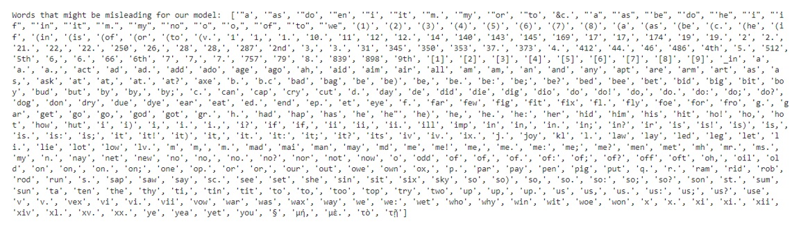

Then <b>tokenization</b> of our input text. Since LLM's are sequential it means they generate some things in sequence, these things we call tokens. They can be words, letters, subwords... Current implementation of GPT4.0 uses subwords. 

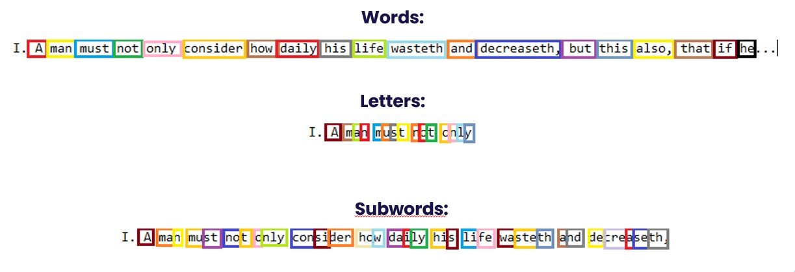

Choice of tokens changes our vocabulary size and what our sequence sees (for example 256 words? letters? .. 

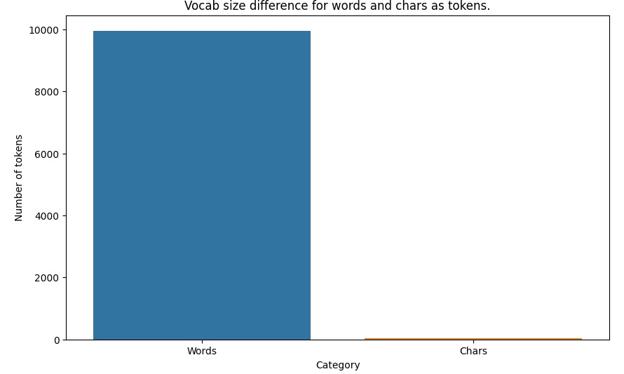

We have to provide the model with numeric data because computers don't understand letters and deep neural networks do calculations with numbers. The process of turning our input text into numbers is called <b>Encoding</b> and <b>Decoding</b> is the reverse process of turning numbers back into letters (this is done when our model generates the next token in sequence so we want to read it). 

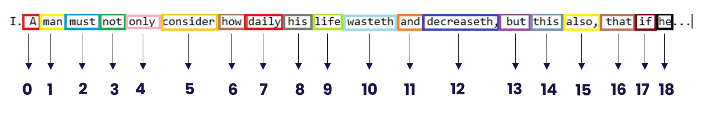

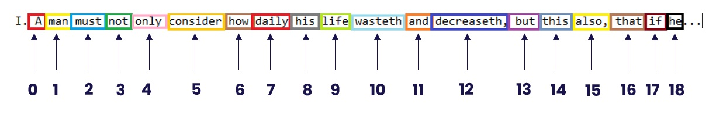

We also have to split the data into <b>training</b> and <b>validation sets</b>. The training set is what the model sees and learns during training and validation is used to see if the model is actually good or it overfitted (we don't want this). You can think of it like a student studying for exam (training set) 

and then his/her knowledge gets tested on the exam (validation set).  

The split can be 80% input data goes to training data, and 20% to validation data. 
Now we have to separate data into what we want to use for predicting the next token in the sequence and the data that represents this next token to be predicted in the sequence. These are called characteristics (x) and labels (y) respectively. We also want to make this data be something of choosable length since we said that LLMs are sequence models, so lets use a sequence of tokens. These sequences of choosable length are called <b>blocks</b>. 

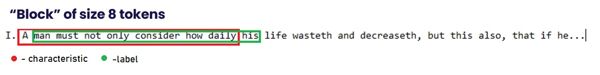

Then we can pick many examples to feed to the model and pack them into a <b>batch</b>. You can think of a batch as a packaging of more blocks. 

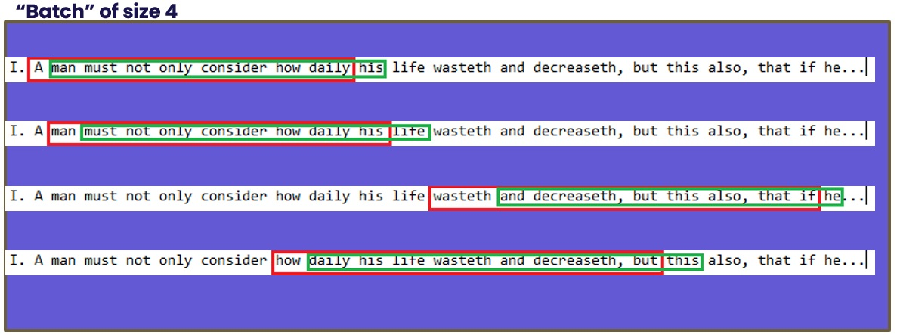

Why do this? Because it improves our model generalisation (so it doesn't learn the data by heart) and also we can feed one batch to one ALU (arithmetic logic unit - the thing that does math in a cpu and logical operations). GPU's have many ALU units so we can put many batches to be processed simultaneously, this will speed up the process of training a lot. Green rectangles on the picture bellow are ALU units. 

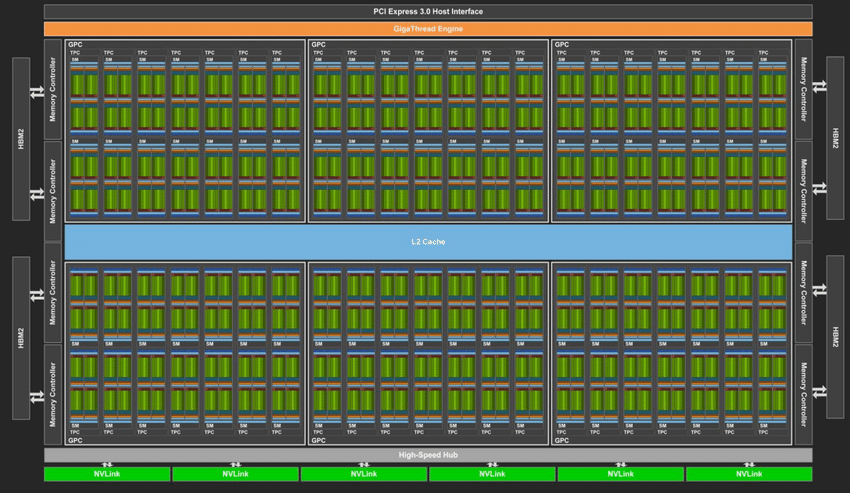

## 3. Model training

Let's look at how a model is trained so we can understand the architecture better later. 

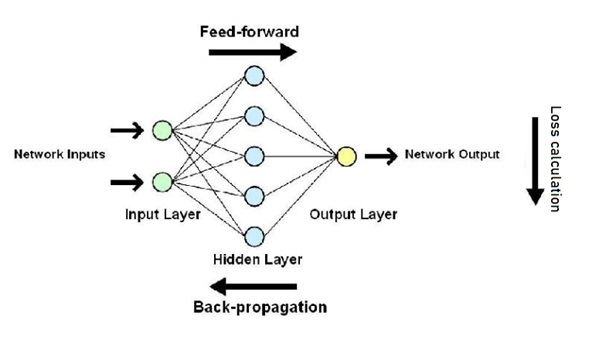

Each deep neural network model's training consists of three stages: 
&nbsp;&nbsp;&nbsp;&nbsp;a. Forward propagation 
&nbsp;&nbsp;&nbsp;&nbsp;b. Loss calculation 
&nbsp;&nbsp;&nbsp;&nbsp;c. Backward propagation 

### a. Forward propagation

The models input data (green circles in the picture above) is forwarded through the network (blue circles) and mathematical operations are done to it (because they're numbers as we remember from the encoding stage). Then we get the output (our models prediction for the next token in the sequence), now comes Loss Calculation.
At every neuron we have some calculation looking like this. 

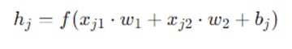

What we're teaching the model are these <i>xj1</i> and <i>xj2</i>, the models weights. The <i>w1</i> and <i>w2</i> are the inputs (green circles, the data, tokens represented as numbers) and the <i>xbj</i> is the bias which is there in case the other output (multiplication and addition of the previous elements mentioned in the formula) is equal to 0. We don't want this because then the backward propagation won't learn anything, so we give the model a small bias (a small number) to move it from a dead stop so to say. The <i>f</i> is just an activation function which you can think of as another step in data processing. There are many activation functions but we're using <b>ReLU (Rectified linear unit)</b> for our implementation. It squashes negative values and leaves positive as they are. In other words if our output is negative it will become 0, and if it is positive it will stay as it is. 

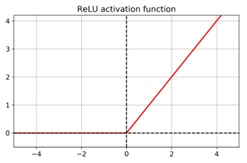

### b. Loss calculation

Since the model has predicted something now we can compare it to what actually should be and see how good our model is. How do we know what should actually be the next token in the sequence? By the green rectangle from the block step if you remember. That is our reference, that is what we're trying to predict. For tokens up to the 5th token in the red rectangle we want to predict the 5th token in the green rectangle (which is just a rectangle moved one token in to the future so that we know for every length of sequence up to block size what is the next token that should come).  

Now how can we calculate the loss (how bad our model is)? We can use many functions (MSE, MAE...), but for our purpose we will use <b>Cross entropy</b>. We have a bit of math here now.  

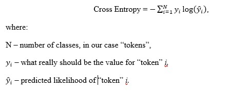

It is important to see here we calculate loss for the miss judgement of the actual class that should follow. In other words if the next token in the sequence is "apple" and we determine its 20% likely to be the next token, our model gets bigger loss, meaning it will need to correct itself more. So <i>yi</i> is the number taking 1 for the token that should be next ("apple" in this example) and every other token will have <i>yi</i> as 0 so we won't calculate the loss for it. How big will the loss be for this miss judged class (or token in LLM case) we can see on the visual representation of the log function. The less likely do we predict it the bigger the loss will be. Also the function is negative so that the negative output of the log function becomes positive, because we want the loss to be bigger if we made a mistake. 

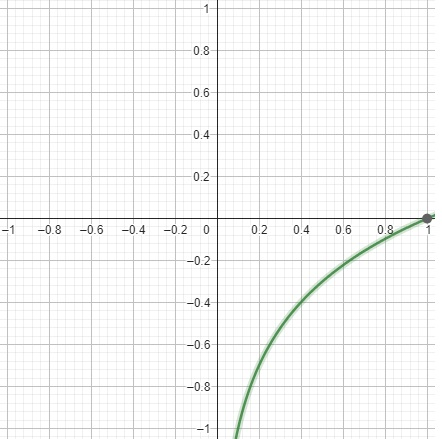

### c. Backward propagation

Now that we have the loss we can update the weights of the model (the <i>xj1</i> and <i>xj2</i> from the forward propagation, remember?). In which direction will we change them? Now we have a bit of math again. The <b>derivative</b> tells us the change of the output compared to the input, or how much the output changes regarding the input. It gives you the slope of the tangent line. 

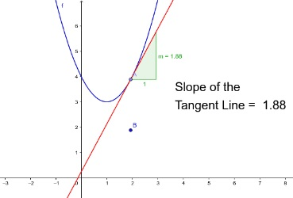

In other words we can see how our weight <i>xj1</i> changes the function by it. 

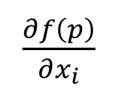

But we have many weights so we can calculate the <b>gradient</b> which is just a vector of more derivatives, so we get how output changes regarding multiple weights. Boom. 

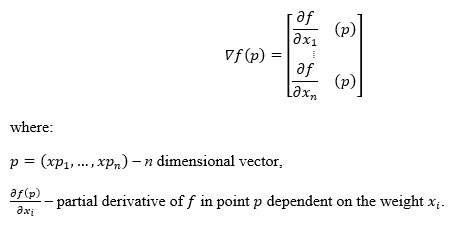

And this visually represented can give us some space where we want to move to the lower (blue) points, because our loss is the smallest there and our model should perform good at those points. Our training should look like the black arrow moving to the holes. 

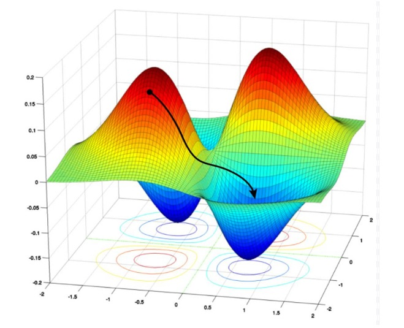

## 2. Model architecture

### Bigram model

Now that we understand the model training, we can come back to the architecture. Let's first look at the <b>Bigram model</b>. The Bigram model only predicts the next word based on the last word in the sequence. So it has probabilities for all words based on the last word in the sequence.  

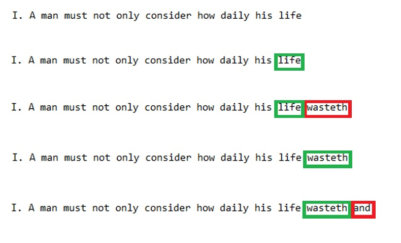

It captures this data in a special table called embedding table. An embedding is a vector (array) that stores numbers which act as characteristics of a word. An embedding "places" a word in a n-dimensional space where words with similar semantic meaning are close to each other. 

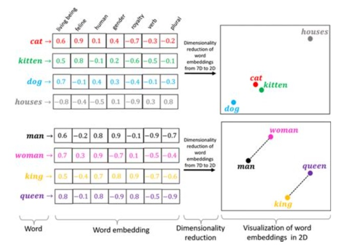

Bigram is a pretty simple model, so lets now dive in to the chaos of the well known transformer model called GPT.

### GPT model

So starting off, GPT was introduced in 2018. inspired by a famous paper <i>"Attention is all you need"</i> released in 2017. This is what it visually looks like. 

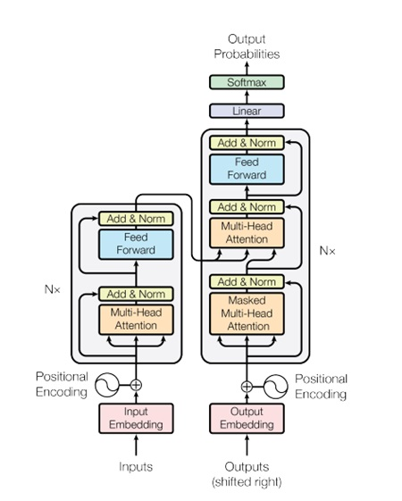

The left part is the encoder part and the right part is the decoder part. Our implementation focuses only on the right part so we have something like this. 

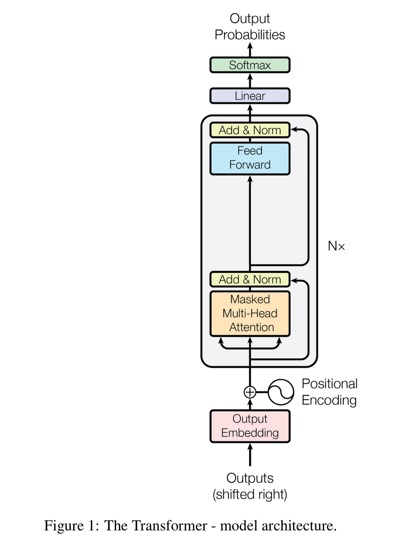

So we see from the bottom "Positional encoding". The GPT has another embedding table which doesn't capture the semantic relation between the tokens, but rather their positional relation in the text. For prediction we sum the values from this two tables for one the data passed into the model (which is of size Batch x Block x Embedding dimensions). Then we have a multi head attention block. Let's see what one head is.  

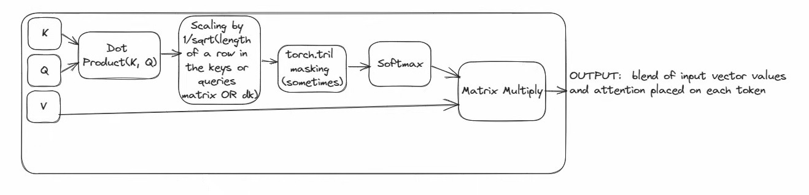

We have <i>K-key, Q-query, V-value</i>. The key is a vector representing marks what a token is, the query is a vector representing what a token seeks for. Now since we pass one block of data which has multiple tokens we will have a matrix where each row in the keys matrix is a vector representing what that token is and respectively in the queries matrix what that token seeks. We get these matrices by simply passing our input to a Linear layer which will "map" our data into head_size dimension we want. We can think of this like choosing how many characteristics we want to capture. Now we transpose the keys matrix and multiply queries matrix with it. This way we get the relationships between different tokens. Intuitively if a token has a key vector and it has high characteristic at index 2 (has a bigger number on this index) and there is another token that has a query vector that seeks for highly for the characteristic at index 2 (has a bigger number on this index) these two vectors will multiply and give a bigger number on this index thus "paying attention" better to each other. This will happen for all keys, queries for all the tokens in the sequence passed to the model, so we get a matrix. We will divide this matrix by a square of the embedding size, for normalisation purposes. After this we get something looking like this. 

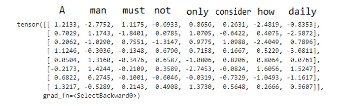

Now when we're predicting the next token in the sequence we only want to look into the past context because we want to model to predict the next token based on previous ones (in the training process we know what should come next but we don't model to have this information because it won't have it when we finish training and try to generate text with it). To do this we can generate a <i>"tril" matrix</i>. A "tril" matrix is a matrix which has zeros above the main diagonal and ones above it. Additionally we can pull this matrix through a softmax function which just makes sure that the sum of each row is equal to 1 so that we introduce a probability distribution. Here's what it looks like. 

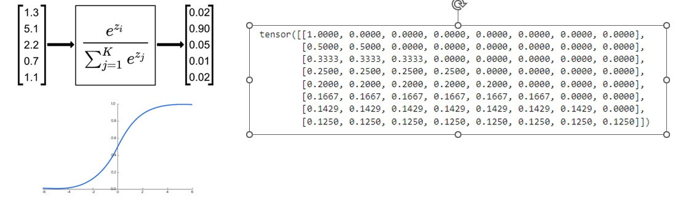

So now we can multiply the previous matrix which if we remember captures relationships between tokens and get something like this. 

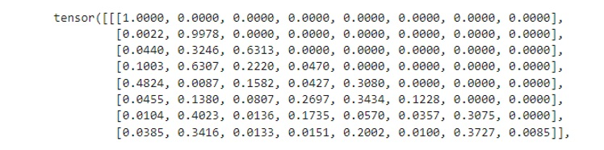

Now remember the value matrix from the beginning of the talk about the transformer head which is created the same way as the key or query matrix by passing the input through a linear layer, yes we take that matrix and multiply it with the above one, and BOOM we have a matrix capturing semantic, positional data and relationships between tokens. What can we understand from this matrix? If we look at the picture of the previous matrix and we look at the 5th row which symbolizes the 5th token in the sequence we can see it wants to "learn" the most about the 1st and 3rd token because they have the highest numbers. And this is how the transformer captures contextual information and can understand human text good, it is how it solves the problem the bigram model has. It doesn't use just the last token So now you may be wondering okay but why is the layer called multi-head attention? It's because this was a representation of one head, but in the GPT there are multiple heads processing data separately which gives us more diverse data. In my implementation it's 6 heads. On the exit of this multi-head masked (masked because of "tril" masking of the future data) these outputs of heads are concatenated.  

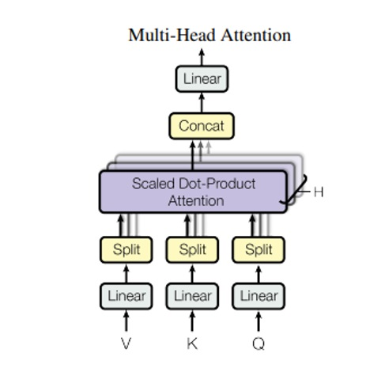

The important thing to see here is the residual connection. It's this arrow that goes around the masked multi head attention directly to add & norm layer. There's a phenomenon where gradient because very small in back propagation in deep neural networks so that layers on small depths don't get updated that much, this connection helps avoid this situation by making the gradients travel to it avoiding very deep complexity of the masked multi head attention. 
Next in the line is the feed forward layer which is composed of a linear layer, ReLU layer, linear layer and a dropout layer. A dropout layer just nulls some outputs so that the model doesn't overfit (learns the training data by heart).  

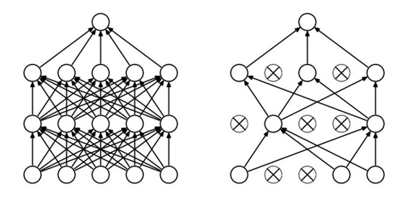

The feed forward layer can be thought of as tokens "processing" what they've learnt so far about other tokens but separately in a 4x bigger dimension and we can see the residual connection here as well going to the additional add & norm layer.  

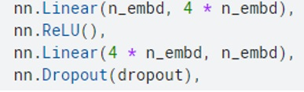

At the end we have an additional linear layer to go back from from the embedding dimension to the dimension of our vocabulary and after that a softmax layer to give us probabilities for the next token in the sequence. 
If you've read so fat congrats! If you understood so far big congrats!!! 
Now you have a understanding how the GPT model works and you can flex your knowledge to your friends. 😎☕   

## Some examples of my GPT models generations

The model was trained on the book Meditations by Marcus Aurelius.

### GPT with word tokens

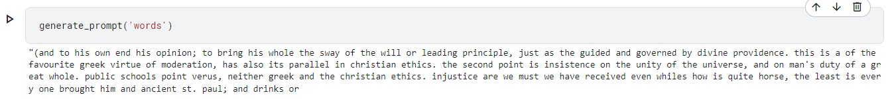

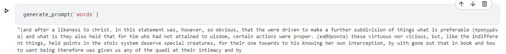

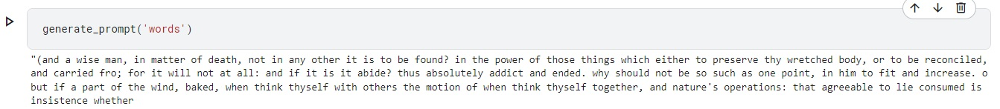

Training loss:

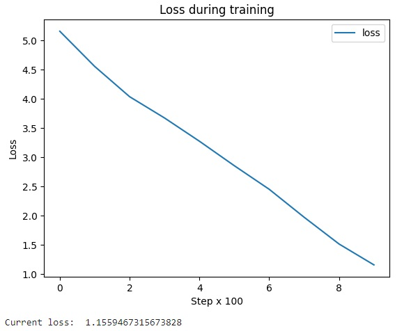

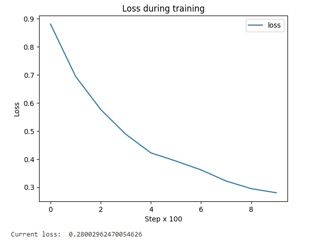

### GPT with letter tokens

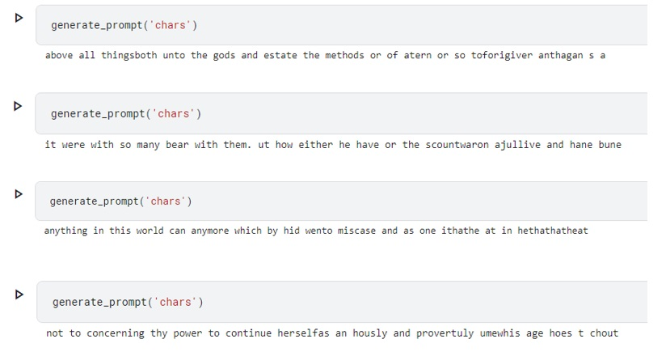

Training loss:

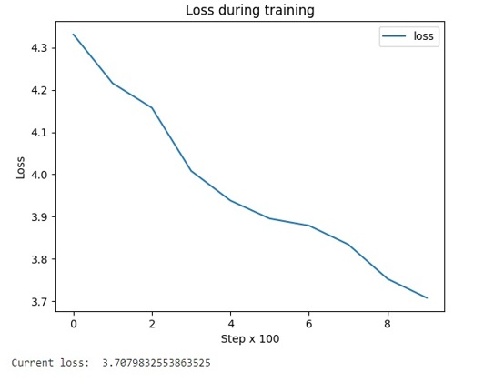
